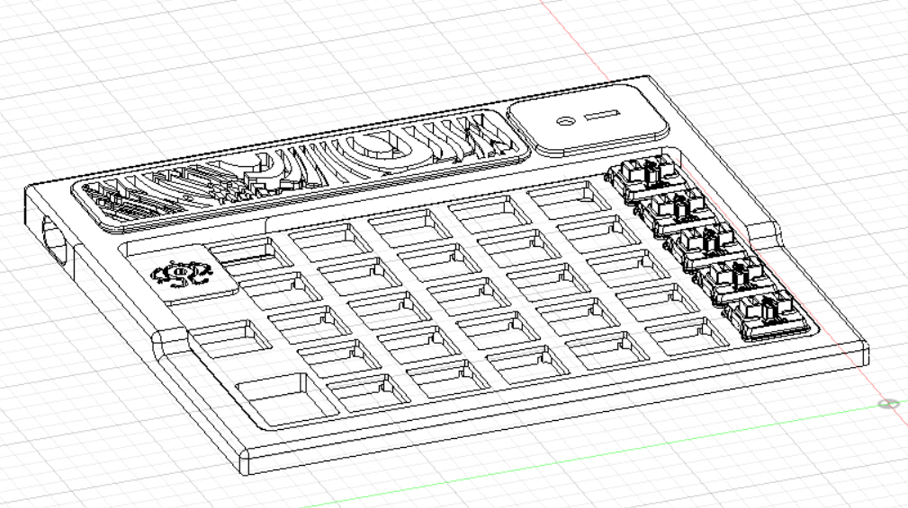

# Tupã
Choc Split Handwired Wireless Keyboard 

## BOM

| Qty | Part | Description | Notes |
|-----|------|-------------|-------|
| 1 | nRF52840 | MCU module (nice!nano / Supermini) | |
| 2 | SMD tactile buttons | Reset bootloader switches | |
| 62 | Choc V1 switches | Low-profile Kailh Choc | |
| 62 | 1N4148 diodes | SMD or through-hole | |
| 2 | 350mAh Li-Ion batteries | 3.7V | |
| 2 | JST connectors | Male/female, for battery connection | |
| 1 | PLA case | 3D printed | See `stl/` |